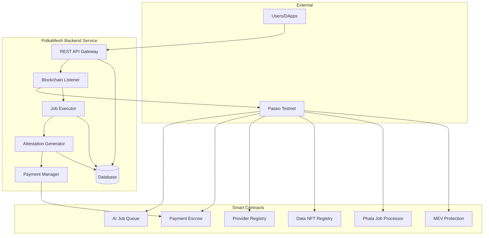
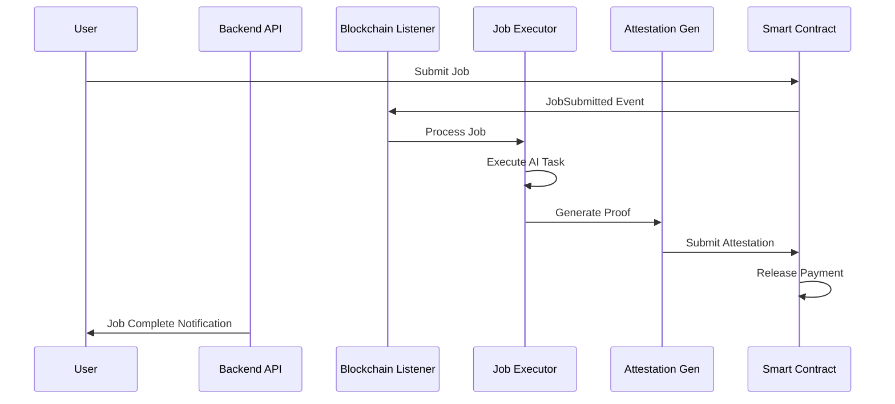
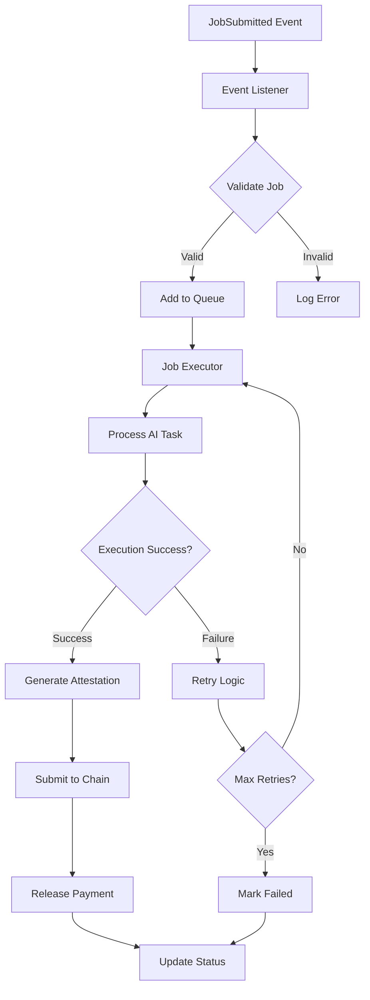
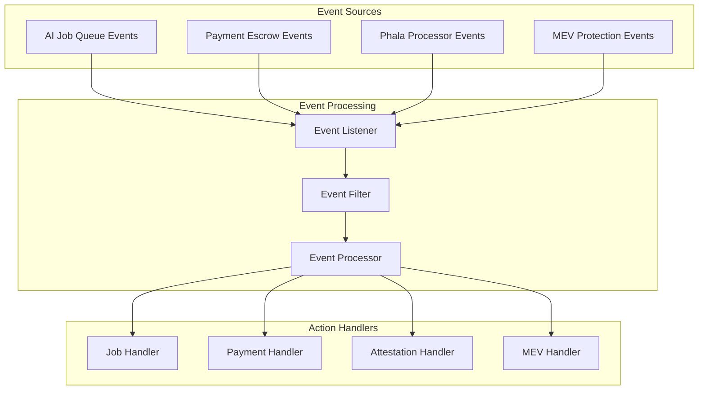

# PolkaMesh Backend Service

## 🚀 Overview

The **PolkaMesh Backend Service** is a comprehensive NestJS-powered automation engine that bridges blockchain events with AI job execution. It serves as the central orchestrator for the PolkaMesh ecosystem, handling event monitoring, job processing, attestation generation, and payment automation.

## 🎯 What This Service Does

This production-ready backend service provides:

- **🔄 Event Automation**: Real-time monitoring of 6 deployed smart contracts
- **⚡ Job Execution**: AI inference and training job processing
- **🛡️ Attestation**: Cryptographic proof generation for job results
- **💰 Payment Flow**: Automated escrow release and settlement
- **📊 Analytics**: Comprehensive metrics and monitoring
- **🔗 API Gateway**: RESTful endpoints for frontend integration
- **🐳 Containerized**: Docker deployment ready

## 📁 Service Architecture

```
PolkaMesh-Backend-Service/
├── src/
│   ├── modules/
│   │   ├── blockchain/          # Polkadot.js integration
│   │   ├── contracts/           # Smart contract services
│   │   ├── jobs/               # AI job processing
│   │   └── attestation/        # Proof generation
│   ├── common/                 # Shared utilities
│   ├── config/                 # Environment configuration
│   └── main.ts                 # Application entry point
├── abis/                       # Contract ABI files
├── docker-compose.yml          # Container orchestration
└── README.md                   # This file
```

## 🌐 System Integration

### Architecture Overview



### Service Flow



## � API Endpoints

### Health & Status

| Endpoint     | Method | Description               |
| ------------ | ------ | ------------------------- |
| `/health`    | GET    | Service health check      |
| `/status`    | GET    | System status and metrics |
| `/contracts` | GET    | Contract deployment info  |

### Job Management

| Endpoint           | Method | Description     |
| ------------------ | ------ | --------------- |
| `/jobs`            | GET    | List all jobs   |
| `/jobs/:id`        | GET    | Get job details |
| `/jobs/:id/status` | GET    | Get job status  |
| `/jobs/:id/result` | GET    | Get job result  |

### Analytics

| Endpoint   | Method | Description              |
| ---------- | ------ | ------------------------ |
| `/metrics` | GET    | Performance metrics      |
| `/events`  | GET    | Recent blockchain events |
| `/stats`   | GET    | System statistics        |

### Example API Usage

```typescript
// Get service status
const response = await fetch("http://localhost:3000/status");
const status = await response.json();

// Get job details
const job = await fetch("http://localhost:3000/jobs/123");
const jobData = await job.json();

// Get system metrics
const metrics = await fetch("http://localhost:3000/metrics");
const metricsData = await metrics.json();
```

## 🔄 Event Processing Flow

### Job Lifecycle Management



### Contract Event Monitoring



## 🛠️ Development

### Project Structure

```
src/
├── modules/
│   ├── blockchain/
│   │   ├── blockchain.module.ts
│   │   ├── blockchain.service.ts
│   │   └── event-listener.service.ts
│   ├── contracts/
│   │   ├── contracts.module.ts
│   │   ├── payment-escrow.service.ts
│   │   ├── job-queue.service.ts
│   │   ├── phala-processor.service.ts
│   │   └── mev-protection.service.ts
│   ├── jobs/
│   │   ├── jobs.module.ts
│   │   ├── job-executor.service.ts
│   │   └── model-runner.service.ts
│   └── attestation/
│       ├── attestation.module.ts
│       └── attestation-generator.service.ts
├── common/
│   ├── guards/
│   ├── interceptors/
│   └── pipes/
├── config/
│   └── configuration.ts
└── main.ts
```

### Available Scripts

```bash
# Development
npm run start:dev          # Start with hot reload
npm run start:debug        # Start with debugging
npm run start:prod         # Production build and start

# Building
npm run build              # Build for production
npm run prebuild          # Pre-build setup

# Testing
npm run test               # Run unit tests
npm run test:e2e           # Run end-to-end tests
npm run test:cov           # Test coverage report

# Code Quality
npm run lint               # ESLint check
npm run lint:fix           # Fix linting issues
npm run format             # Prettier formatting

# Docker
npm run docker:build       # Build Docker image
npm run docker:run         # Run Docker container
```

### Testing

```bash
# Run all tests
npm test

# Run specific test suite
npm test -- --testNamePattern="BlockchainService"

# Run tests with coverage
npm run test:cov

# E2E testing
npm run test:e2e
```

## 🚀 Production Deployment

### Docker Production Setup

```bash
# 1. Build production image
docker build -t polkamesh-backend .

# 2. Run with environment variables
docker run -d \
  --name polkamesh-backend \
  -p 3000:3000 \
  --env-file .env.production \
  polkamesh-backend

# 3. Using Docker Compose (Recommended)
docker-compose -f docker-compose.prod.yml up -d
```

### Environment Configuration

```bash
# .env.production
NODE_ENV=production
PORT=3000
LOG_LEVEL=info

# Enhanced Security
JWT_SECRET=your-production-secret
API_RATE_LIMIT=1000

# Performance Optimization
MAX_CONCURRENT_JOBS=50
JOB_TIMEOUT=600
CACHE_TTL=3600
```

## 📊 Monitoring & Analytics

### Health Check Response

```json
{
  "status": "ok",
  "uptime": 3600,
  "contracts": {
    "paymentEscrow": "active",
    "jobQueue": "active",
    "phalaProcessor": "active",
    "mevProtection": "active"
  },
  "performance": {
    "totalJobs": 1250,
    "successRate": "95.8%",
    "avgProcessingTime": "2.3s"
  }
}
```

## 🤝 Contributing

### Development Workflow

1. **Fork** the repository
2. **Create** feature branch: `git checkout -b feature/your-feature`
3. **Implement** changes with tests
4. **Ensure** linting passes: `npm run lint`
5. **Submit** pull request

### Code Standards

- TypeScript with strict type checking
- ESLint with Airbnb configuration
- Jest for testing
- NestJS best practices

## 🐛 Troubleshooting

### Common Issues

**Service connection failure**:

```bash
# Check RPC endpoint
curl -X POST -H "Content-Type: application/json" \
  -d '{"jsonrpc":"2.0","method":"system_health","params":[],"id":1}' \
  wss://rpc1.paseo.popnetwork.xyz
```

**High memory usage**:

```bash
# Monitor memory
docker stats polkamesh-backend
```

## 🔗 Related Projects

| Repository              | Purpose         | Status       |
| ----------------------- | --------------- | ------------ |
| **PolkaMesh-Contracts** | Smart contracts | ✅ Deployed  |
| **PolkaMesh-SDK**       | TypeScript SDK  | ✅ Published |
| **PolkaMesh-Frontend**  | Web interface   | ✅ Live      |
| **phala_phat_contract** | TEE worker      | ✅ Ready     |

## 📄 License

**Apache-2.0** - see [LICENSE](./LICENSE) file for details

---

## 🚀 Quick Start Summary

```bash
# Setup and run
git clone <repository>
cd PolkaMesh-Backend-Service
npm install
cp .env.example .env
npm run start:dev

# Production deployment
docker-compose up -d
```

**Built with ❤️ for the Polkadot ecosystem using NestJS**

